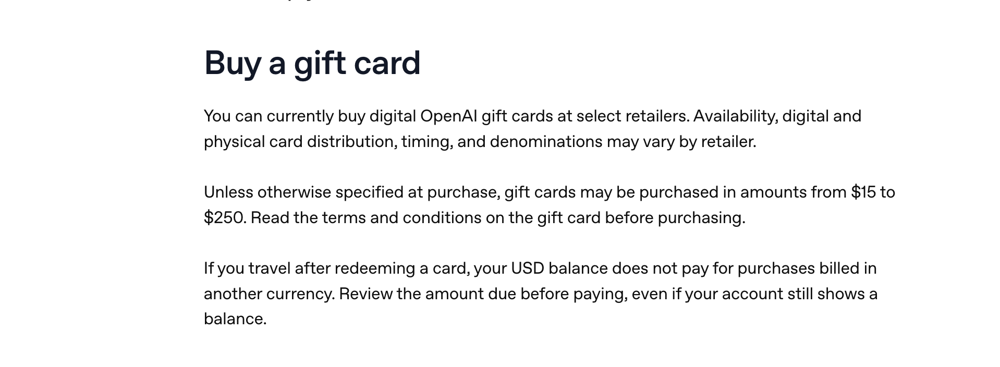
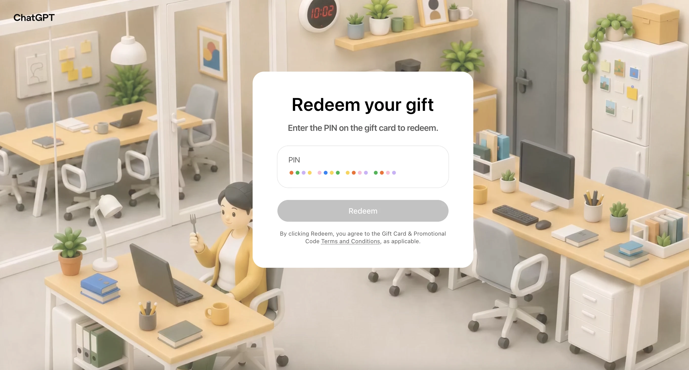
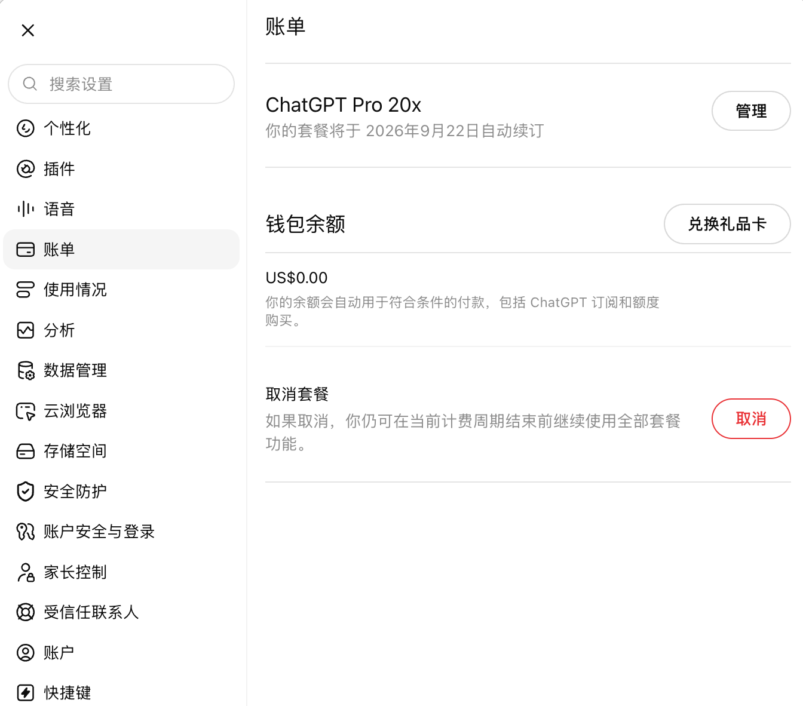

# OpenAI Gift Card 怎么买？ChatGPT 官方礼品卡购买与兑换指南（2026）

> **最后核对：2026 年 9 月 2 日 17:44（北京时间）**
>
> **当前状态：** OpenAI 已公布 Gift Card 的购买、兑换和钱包规则，并称数字礼品卡可从部分参与计划的授权零售商购买；但截至上述时间，[OpenAI 官方帮助页](https://help.openai.com/en/articles/20001491-buying-and-redeeming-openai-gift-cards)仍未列出任何零售商名称或购买链接。本文的公开检索也尚未找到能由 OpenAI 官方页面反向验证的零售商商品页。
>
> 所以，这一版是「**官方规则核对 + 购买渠道追踪 + 兑换流程预案**」，不是已经完成购买的实测报告。等可验证渠道出现并完成亲测后，我会补上零售商、实际付款、送达时间、关键截图和失败记录。

## 30 秒结论

OpenAI Gift Card 是用于 ChatGPT 的美元储值礼品卡。兑换后，礼品卡的全部金额会进入该账号的 ChatGPT Wallet，再由钱包在符合条件的 ChatGPT 网页结账中自动抵扣。

目前最重要的限制有五条：

1. **购买和兑换当前仅限美国。**
2. 兑换人必须真实身处美国，并使用美国、美元计费的 ChatGPT 账号。
3. 官方礼品卡 PIN 直接在 [chatgpt.com/redeem](https://chatgpt.com/redeem) 兑换。
4. 兑换礼品卡只会增加 Wallet balance，**不会自动开通 Plus 或 Pro**。
5. Wallet 不能支付 Apple App Store、Google Play 管理的订阅，也不能支付 OpenAI API 账单。

> [!IMPORTANT]
> **当前最缺的不是兑换步骤，而是可验证的购买入口。** 在 OpenAI 公布零售商名单，或出现能与官方条款相互验证的正式商品页之前，不建议把任何第三方页面自称的「ChatGPT 礼品卡」直接当成 OpenAI Gift Card。

## 目录

- [OpenAI Gift Card 到底是什么](#openai-gift-card-到底是什么)
- [现在在哪里购买](#现在在哪里购买)
- [暂时没有购买渠道，怎么选择](#暂时没有购买渠道怎么选择)
- [怎样判断是不是官方礼品卡](#怎样判断是不是官方礼品卡)
- [购买前资格检查](#购买前资格检查)
- [官方兑换步骤](#官方兑换步骤)
- [如何用 Wallet 开通 Plus 或 Pro](#如何用-wallet-开通-plus-或-pro)
- [第三方「ChatGPT 礼品卡」注意事项](#第三方chatgpt-礼品卡注意事项)
- [常见问题](#常见问题)
- [官方资料与更新时间](#官方资料与更新时间)

## OpenAI Gift Card 到底是什么

它不是一张银行卡，也不是直接开通一个月会员的订阅码。

正确的资金路径是：

~~~mermaid
flowchart LR
    A[参与计划的授权零售商] --> B[OpenAI Gift Card PIN]
    B --> C[chatgpt.com/redeem]
    C --> D[ChatGPT Wallet 美元余额]
    D --> E[ChatGPT 网页端购买或续费]
    E --> F[Go / Plus / Pro 等符合条件的项目]
~~~

兑换后会发生两件事：

- 礼品卡的全部金额进入当前账号的 ChatGPT Wallet；
- Wallet 在以后符合条件的网页结账中自动优先抵扣。

兑换后**不会**发生这些事：

- 不会因为兑换成功就自动变成 ChatGPT Plus；
- 不会增加 OpenAI API credits；
- 不会进入 Apple ID 或 Google Play 余额；
- 不会生成一张可在其他商户使用的通用支付卡。

官方目前说明，礼品卡通常可购买的金额范围为 **$15–$250**，但具体金额、数字卡或实体卡形式都由零售商决定。网上常见的 $15、$25、$50、$100、$200、$250 列表，不应在没有真实零售商页面佐证时写成固定的「官方面额」。

## 现在在哪里购买

OpenAI 的帮助页写明：数字礼品卡可通过部分参与计划的授权零售商购买，实体卡也会通过参与计划的零售商销售。

  

图 1：OpenAI 官方目前只写明「部分零售商」以及通常为 $15–$250，具体供应时间、形式和金额由零售商决定。

> [!CAUTION]
> **重点：这张官方截图没有给出任何零售商名称或购买链接。** 它能证明礼品卡计划已经开放，不能证明某个第三方商家已经获得正式货源。

但截至 2026 年 9 月 2 日 17:44（北京时间）：

| 检查项 | 当前结果 |
| --- | --- |
| OpenAI 官方帮助页是否确认计划存在 | 是 |
| 官方页是否列出零售商名称 | 否 |
| 官方页是否提供购买链接 | 否 |
| 公开搜索是否找到可由 OpenAI 反向验证的商品页 | 暂未找到 |
| 本文是否已经完成实购 | 否 |

**截至核对时间，公开渠道里还没有找到。**

## 暂时没有购买渠道，怎么选择

如果你关注的是 OpenAI Gift Card 本身，建议等待可验证的授权零售商出现，不要为了抢先尝试来源不明的产品。

如果你的实际目的只是现在开通 ChatGPT，则不必把礼品卡当成唯一方案，可以按现有条件选择：

| 你的情况 | 更合适的做法 |
| --- | --- |
| 已有 OpenAI 支持的付款方式 | 直接在 ChatGPT 网页端订阅 |
| 希望使用微信支付、减少操作步骤 | [了解 AONIR ChatGPT Plus / Pro 充值流程](https://aonir.com/?utm_source=github&utm_medium=referral&utm_campaign=openai_gift_card&utm_content=options_table) |

AONIR 是面向国内用户的 AI 订阅充值服务，支持 ChatGPT Plus / Pro、Claude Pro，微信支付，充值到用户本人官方账号，不提供共享账号。

有 iPhone 或 iPad、希望自己操作 Apple 礼品卡的用户，可参考另一篇已完成实测的教程：[ChatGPT Plus 国内充值指南（2026）：美区 Apple 礼品卡实测](https://github.com/Avarce/chatgpt-plus-china-guide)。

## 怎样判断是不是官方礼品卡

看到新商品页时，先检查下面这条证据链：

1. **销售方可验证。** 最强证据是 OpenAI 官方帮助页直接列出或链接该零售商；其次是零售商自己的正式商品页、适用条款和发行信息能彼此对应。
2. **产品名称与用途一致。** 商品应明确是 OpenAI Gift Card，并说明兑换为 ChatGPT Wallet balance。
3. **兑换域名正确。** 官方 PIN 应直接在 [chatgpt.com/redeem](https://chatgpt.com/redeem) 使用。
4. **条款一致。** 地区、币种、金额、退款和使用限制应与[官方帮助页](https://help.openai.com/en/articles/20001491-buying-and-redeeming-openai-gift-cards)及[礼品卡条款](https://mycardterms.com/openai/home/terms/)一致。
5. **不从转售市场购买。** 官方条款提示，从未经授权的卖家、转售商或拍卖网站取得的卡可能无效。

如果一个产品要求你先去第三方网站兑换，再生成卡号、有效期和 CVV，最后把它作为支付卡填进 ChatGPT 收银台，那么它属于第三方支付产品，**不是本次新上线、在 chatgpt.com/redeem 兑换的 OpenAI Gift Card**。

## 购买前资格检查

即使已经出现正式购买入口，也建议先逐项确认：

| 检查项 | 需要满足的条件 |
| --- | --- |
| 人所在地区 | 兑换时真实身处美国 |
| ChatGPT 账号 | 美国账号 |
| 账号结算币种 | USD |
| 工作区 | 确认兑换到最终使用的 Personal workspace；Business 场景需核对所有者权限 |
| 当前订阅来源 | 网页端订阅，或目前没有订阅 |
| Apple / Google 订阅 | 如当前由应用商店管理，需先取消并等待订阅实际结束 |
| 购买金额 | 应覆盖计划价格和可能产生的税费 |
| 收件邮箱 | 能正常接收数字卡与收据 |

OpenAI 明确写明，礼品卡的购买和兑换目前仅限美国。把卡发送给美国以外的人，并不会让对方自动获得兑换资格。

不要在最终账号之外先试兑。礼品卡必须一次性、全额兑换进一个账号，兑换后不能拆分，也不能把 Wallet balance 移到另一个账号。

## 官方兑换步骤

找到并购买可验证的礼品卡后，官方流程如下：

  

图 2：ChatGPT 官方兑换页面。OpenAI Gift Card 的 PIN 应直接在 chatgpt.com/redeem 输入。

1. 在浏览器打开 [chatgpt.com/redeem](https://chatgpt.com/redeem)。
2. 登录最终要充值的 ChatGPT 账号。
3. 如果页面要求选择 workspace，确认是正确的 Personal workspace 或符合规则的 Business workspace。
4. 输入礼品卡 PIN。
5. 再次核对账号、工作区和金额，然后确认兑换。
6. 打开 ChatGPT 的 **Settings → Billing**。
7. 检查 Wallet balance 和 Transaction history，确认礼品卡记录已经出现。

兑换前务必检查账号。官方规则要求礼品卡全部金额一次性进入一个账号；兑换完成后，不能将余额移动到其他账号，也不能退回原卡。

  

图 3：账单页面已经出现「兑换礼品卡」入口；当前 US$0.00 是兑换前状态。

## 如何用 Wallet 开通 Plus 或 Pro

礼品卡兑换成功后，还要单独完成订阅购买：

1. 保持登录同一个 ChatGPT 账号，在网页端打开升级页面。
2. 选择需要的 Go、Plus 或 Pro 计划，以实际结账页为准。
3. 在付款确认页检查计划价格、税费、Wallet applied 和 Due today。
4. 如果余额不足，结账页会要求使用其他付款方式支付差额。
5. 如果余额足额覆盖，部分结账可能允许暂不添加付款方式；但 OpenAI 明确说明，这并不适用于所有结账，试用或促销也可能仍要求付款方式。
6. 确认购买后，检查当前计划、下次续费日期、钱包剩余余额和交易记录。

ChatGPT Wallet 会自动优先抵扣，用户不能指定「这次只使用一部分钱包余额」。卡内有余额也不等于已经订阅，必须完成上面的计划购买。

[OpenAI 当前帮助页](https://help.openai.com/en/articles/6950777-what-is-chatgpt-plus)显示 ChatGPT Plus 为 $20/月，但最终应以账号结账页显示为准，税费可能使应付总额高于 $20。不要只按标价购买刚好等额的礼品卡，再假设一定能够覆盖最终账单。

## 第三方「ChatGPT 礼品卡」注意事项

搜索「ChatGPT Gift Card」时，可能会看到 Rewarble 或其他第三方 voucher。它们不一定是假产品，但**不等于这次 OpenAI 新上线的官方礼品卡**。

> [!CAUTION]
> Rewarble 的流程是先在其网站兑换 voucher，再生成带卡号、有效期和 CVV 的 Reward Card；其页面也明确声明与展示品牌没有背书、关联或赞助关系。OpenAI Gift Card 则应直接在 chatgpt.com/redeem 兑换并进入 ChatGPT Wallet。

判断时只看两个关键点：**是否直接在 chatgpt.com/redeem 兑换，以及兑换结果是否进入 ChatGPT Wallet。**

## 常见问题

<strong>OpenAI Gift Card 现在到底可以买到了吗？</strong>

OpenAI 官方说数字卡可从部分参与计划的授权零售商购买，但截至 2026 年 9 月 2 日 17:44（北京时间），官方帮助页没有列出商家或购买链接，本文的公开检索也没有找到可由 OpenAI 反向验证的商品页。因此目前能确认「计划已经上线」，但还不能在本文中负责任地给出一个购买商家。

<strong>官方固定面额是 $15、$25、$50、$100、$200 和 $250 吗？</strong>

不能这样确定。OpenAI 目前只说明通常可购买 $15–$250，实际金额和卡片形式依零售商而定。等真实授权零售商页面上线后，才能记录它提供的具体选项。

<strong>兑换礼品卡后会立刻变成 ChatGPT Plus 吗？</strong>

不会。兑换只把金额充入 ChatGPT Wallet。你还要在 ChatGPT 网页端选择 Plus，并完成一次正式结账。

<strong>有 OpenAI Gift Card 就一定不需要银行卡吗？</strong>

不能保证。官方说部分余额足额覆盖的结账可能允许暂不添加付款方式，但并非所有结账都支持；试用、促销、余额不足或特定账号状态仍可能要求付款方式。

<strong>礼品卡能支付 ChatGPT Pro 吗？</strong>

官方帮助页将 Pro 列为符合条件的计划之一。最终能否购买、金额是否足够以及是否需要补充付款方式，以该账号的网页结账页为准。

<strong>礼品卡能支付 OpenAI API 吗？</strong>

不能。ChatGPT Wallet 与 OpenAI API billing 是两个独立系统。

<strong>礼品卡会过期吗？</strong>

官方条款目前写明礼品卡不设到期日，也不从卡内金额收取余额费用。兑换后的资金仍受 ChatGPT Wallet 相关条款约束。

<strong>同一个账号能兑换多张吗？</strong>

可以按规则兑换多张符合条件的礼品卡，但会受到账号余额、安全和每日购买限制。官方没有公开所有风控阈值，因此不要把它理解成可以无限叠加。

<strong>兑换错账号后能转移吗？</strong>

不能。确认兑换前一定要核对账号和 workspace。

<strong>当前通过 Apple App Store 或 Google Play 订阅，能直接改用 Wallet 续费吗？</strong>

不能直接抵扣由应用商店管理的订阅。需要先在对应商店取消，并等待当前订阅期真正结束，再回到 ChatGPT 网页端选择符合条件的计划。

<strong>购买后没收到卡，或者 PIN 无法兑换，应该找谁？</strong>

购买、付款、邮件送达、卡片激活以及未使用卡能否退款，先联系零售商并遵循其政策；PIN 兑换、Wallet 或 ChatGPT 结账问题联系 OpenAI Support。

<strong>Gifting Credits 和 OpenAI Gift Card 是同一种东西吗？</strong>

不是。Gifting Credits 通过领取链接向其他用户赠送特定用途的 credits；OpenAI Gift Card 则通过 PIN 兑换为 ChatGPT Wallet balance。两者的用途、领取方式和有效规则不同。

## 官方资料与更新时间

以下资料以官方来源为主：

1. [OpenAI：Buying and redeeming OpenAI Gift Cards](https://help.openai.com/en/articles/20001491-buying-and-redeeming-openai-gift-cards)
2. [OpenAI：Using your ChatGPT wallet balance](https://help.openai.com/en/articles/20001508-using-your-chatgpt-wallet-balance)
3. [OpenAI Gift Card Terms and Conditions](https://mycardterms.com/openai/home/terms/)
4. [OpenAI：Gifting credits in ChatGPT](https://help.openai.com/en/articles/20001417-gifting-credits-in-chatgpt)
5. [OpenAI：What is ChatGPT Plus?](https://help.openai.com/en/articles/6950777-what-is-chatgpt-plus)
6. [Rewarble ChatGPT 页面](https://rewarble.com/brands/chatgpt)（仅用于区分第三方产品，不作为 OpenAI 授权证明）

### 更新记录

- **2026-09-02：** 创建首版状态追踪与兑换教程；核对官方帮助页、Wallet 规则、礼品卡条款、第三方 voucher 路径及公开零售商搜索结果。加入官方购买说明、兑换页和兑换前 Wallet 三张截图；尚未发现 OpenAI 官方可反向验证的零售商购买页，未声称完成实购。

---

如果你发现 OpenAI 官方新列出的零售商，或发现本文某项规则已经变化，欢迎提交 Issue，并附上公开商品页或官方文档链接。

本文为独立研究和操作记录，不代表 OpenAI。ChatGPT、OpenAI 及相关名称和标识归其权利人所有。
