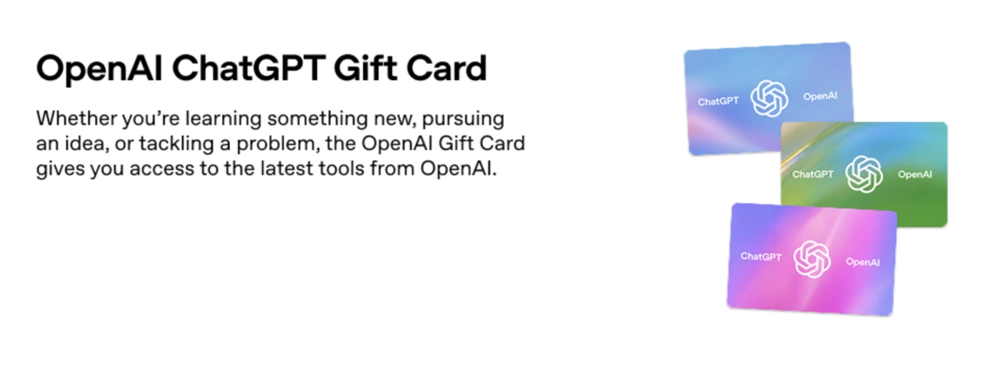
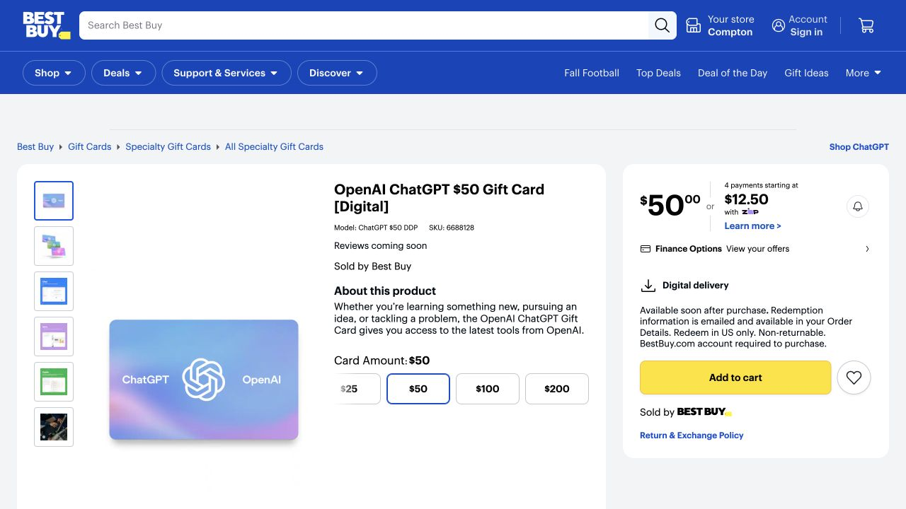
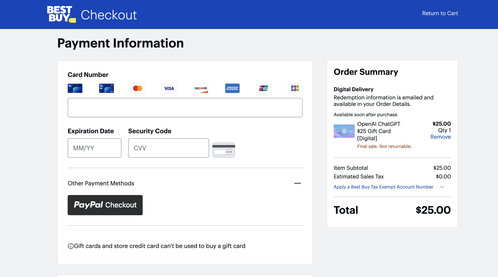
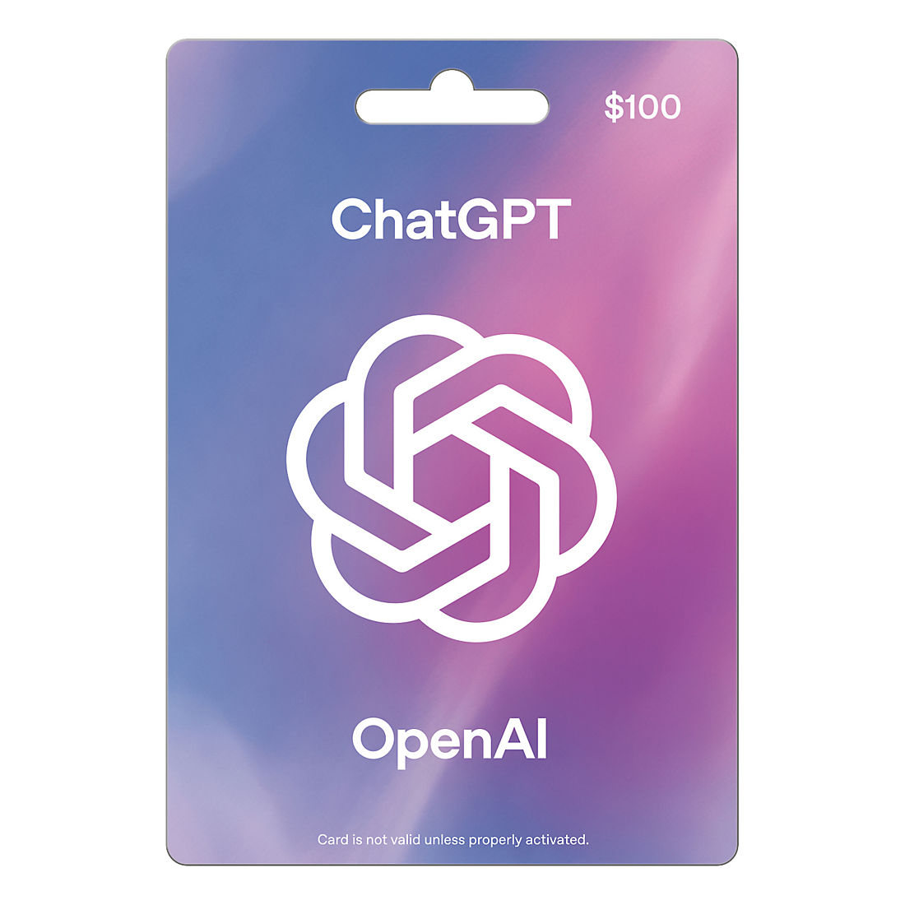
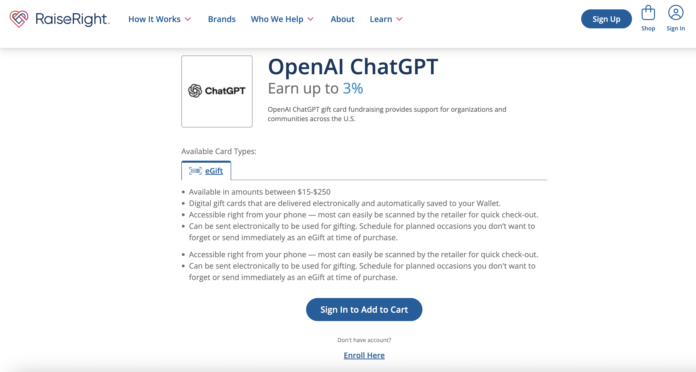
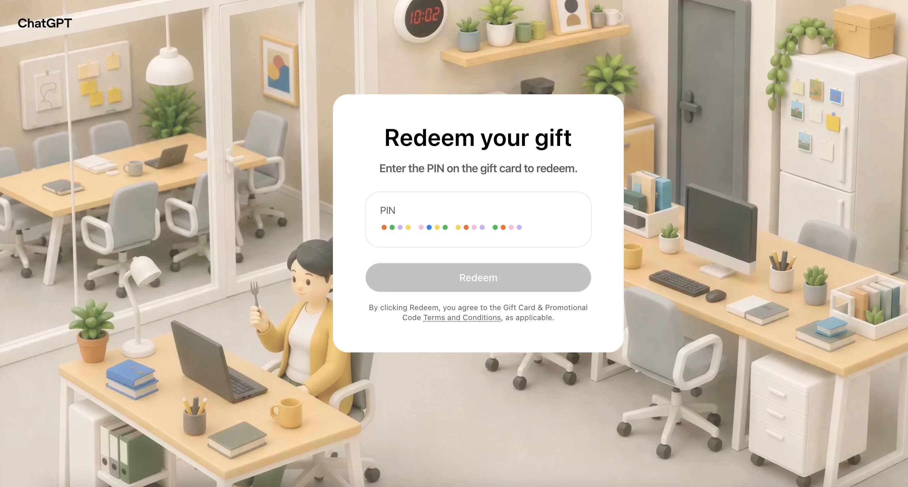
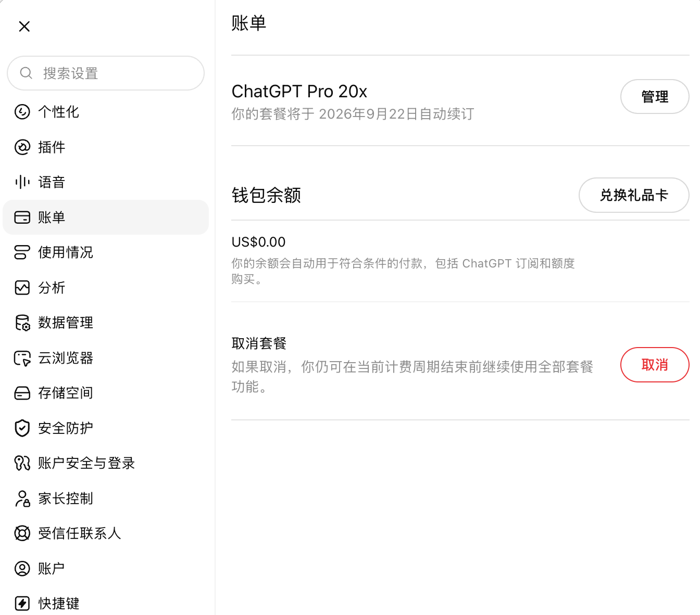

# OpenAI Gift Card 怎么买？ChatGPT 官方礼品卡购买与兑换指南（2026）

> **最后更新：2026 年 10 月 3 日（北京时间）** · 复核 Best Buy 和 RaiseRight 商品页，面额和价格没有变化。OpenAI 帮助页 10 月 2 日更新后仍只点名 Best Buy；据此补充赠送订阅不能兑换、怀疑被盗刷怎么办、商店订阅怎么换成网页订阅。截图保留原核对日期。

## 先说结论

- **官方规定只能在美国用。** OpenAI 礼品卡只在美国销售和兑换：兑换时人要在美国，ChatGPT 账号要按美元计费。国内用户挂美国节点能不能兑换成功，官方没说怎么判断“人在美国”，目前也还没有可靠的实测，见[用美国节点能不能兑换](#用美国节点能不能兑换)。
- **符合条件的话，Best Buy 最省事**：不用会员，$25 / $50 / $100 / $200 四档按面值卖，结账页能选 PayPal。已经是 BJ’s 会员的话它最便宜（$100 面值卖 $98.99）。RaiseRight 只适合已经加入学校或团队筹款计划的人。
- **兑换不等于开通 Plus。** 在 [chatgpt.com/redeem](https://chatgpt.com/redeem) 输入 PIN 后，钱只是进了 ChatGPT Wallet；还要回网页端自己买 Plus 或 Pro，Wallet 会自动抵扣。
- **Wallet 只能付 ChatGPT 网页端的账单**：付不了 App Store / Google Play 管理的订阅，也付不了 OpenAI API。

人在国内的，直接看[国内用户怎么选择](#国内用户怎么选择)。

渠道信息来自各零售商的公开页面和作者截取的结账页，我们没有在这些渠道走完购买加兑换的全流程；遇到实际情况和本文不一致，欢迎提 Issue。规则来源：[OpenAI：购买与兑换礼品卡](https://help.openai.com/en/articles/20001491-buying-and-redeeming-openai-gift-cards)。

## 目录

- [OpenAI Gift Card 是什么](#openai-gift-card-是什么)
- [现在在哪里购买](#现在在哪里购买)：[Best Buy](#best-buy-购买说明) · [BJ’s](#bjs-购买说明) · [RaiseRight](#raiseright)
- [官方兑换步骤](#官方兑换步骤)
- [如何用 Wallet 开通 Plus 或 Pro](#如何用-wallet-开通-plus-或-pro)
- [Wallet、使用额度和 Gifting Credits 的区别](#walletusage-credits-和-gifting-credits-的区别)
- [余额和结账出问题怎么查](#余额和结账出问题怎么查)
- [别买错：官方卡和第三方「ChatGPT 礼品卡」](#别买错官方卡和第三方chatgpt-礼品卡)
- [国内用户怎么选择](#国内用户怎么选择)
- [常见问题](#常见问题)
- [官方资料与更新记录](#官方资料)

## OpenAI Gift Card 是什么

一张美元储值卡，兑换后变成你 ChatGPT 账号里的 Wallet 余额。它不是银行卡，也不是直接开通一个月会员的兑换码。

  

图 1：礼品卡条款站展示的 OpenAI ChatGPT Gift Card 卡面设计。

钱是这样走的：

~~~mermaid
flowchart LR
    A[参与计划的零售商] --> B[OpenAI Gift Card PIN]
    B --> C[chatgpt.com/redeem]
    C --> D[ChatGPT Wallet 美元余额]
    D --> E[ChatGPT 网页端购买或续费]
~~~

几条容易踩坑的规则，出自 2026 年 9 月 1 日生效的[礼品卡条款](https://mycardterms.com/openai/home/terms/)：

| 项目 | 规则 |
| --- | --- |
| 面额 | 单张通常 $15–$250，具体看零售商；单人每天购卡合计不超过 $2,000 |
| 能不能再充 | 卡本身不能再充值；同一账号可以兑换多张，但受账户余额和每日加载上限限制 |
| 会不会过期 | 条款不设到期日，也不收余额管理费；长期不用时仍可能适用美国各州的无主财产规则 |
| 能不能退、能不能卖 | 一般不能退款、不能换现金、不能有偿转售；可以免费送人 |
| 兑换之后 | 全部金额一次进账，不能拆分，不能转到别的账号，也不能退回原卡 |
| 谁发的卡 | 发卡方是 CIMI2604, Inc.，不是 OpenAI 本身 |

## 现在在哪里购买

| 渠道 | 面额 / 价格 | 门槛 | 交付 | 适合谁 |
| --- | --- | --- | --- | --- |
| **[Best Buy](https://www.bestbuy.com/product/openai-chatgpt-25-gift-card-digital/JJG34P73VL/sku/6688130)** | $25 / $50 / $100 / $200，按面值卖 | 普通 BestBuy.com 账号 | 数字卡，邮件和订单详情里给兑换信息 | 大多数人首选 |
| **[BJ’s](https://www.bjs.com/product/chatgpt-100/3000000000006366253/?itemId=3000000000006366254)** | $100 面值，卖 $98.99 | BJ’s 会员 | 数字卡，发到 BJ’s 登录邮箱 | 已经是 BJ’s 会员 |
| [RaiseRight](https://www.raiseright.com/brands/1185-openai-chatgpt) | $15–$250，另收手续费 | 筹款组织的加入码或邀请链接 | 电子卡，先存在 RaiseRight Wallet | 已加入学校、团队筹款计划 |

页面核对日期：Best Buy 与 RaiseRight 为 10 月 3 日，BJ’s 为 9 月 14 日（10 月 3 日商品页打不开，没能复核），价格和供应以结账页为准。OpenAI 帮助页（10 月 2 日更新）点名了 Best Buy，同时说明这不是完整名单。

### Best Buy

商品名 **OpenAI ChatGPT Gift Card [Digital]**，由 Best Buy 销售：[$25](https://www.bestbuy.com/product/openai-chatgpt-25-gift-card-digital/JJG34P73VL/sku/6688130) · [$50](https://www.bestbuy.com/product/openai-chatgpt-50-gift-card-digital/JJG34P73VQ) · [$100](https://www.bestbuy.com/product/openai-chatgpt-100-gift-card-digital/JJG34P787G/sku/6688133) · [$200](https://www.bestbuy.com/product/openai-chatgpt-200-gift-card-digital/JJG34P7874)（SKU 6688130 / 6688128 / 6688133 / 6688129）。

  

图 2：Best Buy 商品页，2026 年 9 月 19 日。点击查看原图。

**步骤：** 登录 BestBuy.com → 选面额 → 核对结账总额 → 付款 → 在订单详情和邮箱里拿兑换信息 → 按[官方兑换步骤](#官方兑换步骤)兑换。商品页标明只能在美国兑换、不可退货，也没有承诺每笔订单即时发卡。

**付款方式：** 结账页显示 Visa、Mastercard、American Express、Discover、JCB、银联（UnionPay）标识，也能选 PayPal。

  

图 3：作者截取的 Best Buy $25 礼品卡结账页，含银联和 PayPal 选项。点击查看原图。

**有银联标识，不代表国内银联卡一定能过。** 能不能发卡还要看银行授权和 Best Buy 的订单审核。账单地址要填真实准确的；付款后没收到卡，先看订单详情和垃圾邮件，银行预授权不等于已经发卡，超过预计时间再找 Best Buy 客服。

### BJ’s Wholesale Club

[ChatGPT $100 · BJ’s](https://www.bjs.com/product/chatgpt-100/3000000000006366253/?itemId=3000000000006366254)：$100 面值卖 $98.99（商品编号 360793），交付方式选 **Digital (Email)**，卡发到 BJ’s 登录邮箱，页面写的是 1–2 小时内发送。

  

图 4：BJ’s 官网的 $100 礼品卡商品图，2026 年 9 月 14 日。卡面图只是商品展示，不代表寄实体卡。

- 需要会员。BJ’s 有 [1-Day Pass](https://help.bjs.com/hc/en-us/articles/26873882893588-What-is-the-1-Day-Shopping-Pass-for-BJs-com)，但帮助页没说它能不能买这款数字卡，先问 BJ’s 再决定办不办会员。
- 礼品卡按 BJ’s [退货政策](https://www.bjs.com/info/returns/)不退款。

### RaiseRight

[OpenAI ChatGPT · RaiseRight](https://www.raiseright.com/brands/1185-openai-chatgpt)：电子卡，$15–$250，9 月 5 日上架。RaiseRight 是学校、团队的筹款平台，要用组织的[加入码或邀请链接](https://support.raiseright.com/hc/en-us/articles/360058346553-Where-to-find-my-organization-s-enrollment-code)注册后才能下单。

  

图 5：RaiseRight 商品页，2026 年 9 月 9 日。点击查看原图。

每笔购卡订单的手续费（[官方说明](https://support.raiseright.com/hc/en-us/articles/44378620085395-Convenience-fees-for-buying-gift-cards)）：

| 付款方式 | 手续费 |
| --- | --- |
| 银行账户 ACH，组织已提供银行资料 | $0.29 |
| 银行账户 ACH，组织未提供银行资料 | $0.79 |
| 借记卡 | 订单面值的 1% |
| 信用卡 | 订单面值的 3% |

比如用信用卡买 $100 面值，要付 $103。页面上的“最高 3%”是给组织的筹款收益，不是结账折扣。

卡买到后先存在 RaiseRight Wallet，**还要去 chatgpt.com/redeem 兑换**，钱才会进 ChatGPT Wallet，两个 Wallet 不会自动同步。

## 官方兑换步骤

  

图 6：ChatGPT 官方兑换页，2026 年 9 月 2 日截图，字段以当前页面为准。

1. 打开 [chatgpt.com/redeem](https://chatgpt.com/redeem)，登录**最终要用的**账号。有 workspace 选项时，个人使用选 Personal；Business 只有所有者能往已创建的工作区兑换。
2. 输入 PIN，核对账号、工作区和金额，确认兑换。
3. 到 **Settings → Billing** 查看 Wallet balance 和交易记录。

兑换前一定核对账号：钱一次全部进账，转不走也退不回。PIN 别发到 Issue 或公开截图里。

  

图 7：账单页面，2026 年 9 月 2 日截图。US$0.00 是兑换前的余额。

## 如何用 Wallet 开通 Plus 或 Pro

1. 用同一个账号在网页端打开升级页面，选套餐。
2. 在结账页看清价格、税费、Wallet applied 和 Due today。
3. 余额不够，差额用其他付款方式补。余额够的话，部分结账可以不加付款方式，但试用、促销等情况仍可能要求绑卡。
4. 买完检查当前套餐、下次续费日和剩余余额。

Plus 标价 $20 / 月，但加上税费可能更高，别刚好按 $20 买卡。Wallet 会自动优先抵扣，没法指定只用一部分。如果人去了美国以外的地方，美元余额付不了按其他币种计费的账单。

## Wallet、usage credits 和 Gifting Credits 的区别

| 名称 | 是什么 | 用来干什么 |
| --- | --- | --- |
| OpenAI Gift Card | 在官方兑换页用的 PIN | 兑换后增加 Wallet 美元余额 |
| ChatGPT Wallet | 账号里的美元余额 | 支付网页端的订阅、续费和额度购买 |
| 使用额度（usage credits） | Work、Codex 等功能的用量 | 需要单独购买，可以用 Wallet 付 |
| Gifting Credits | 送给别人的一次性领取链接 | 领取后增加对方的使用额度，不是 Wallet 余额 |

**往 Wallet 充钱，不等于买好了 Codex / Work 的使用额度**，额度要另外买。Gifting Credits 的领取链接要在购买后 30 天内使用，领取后的额度 12 个月有效，规则跟礼品卡不一样。来源：[Wallet 说明](https://help.openai.com/en/articles/20001508-using-your-chatgpt-wallet-balance) · [Gifting Credits](https://help.openai.com/en/articles/20001417-gifting-credits-in-chatgpt)

## 余额和结账出问题怎么查

先到持有余额的账号打开 **Settings → Billing**，对着交易记录看：

| 看到的情况 | 先查什么 |
| --- | --- |
| `Loading balance…` 或 `Not available` | 余额暂时没显示，不等于是零。刷新后看交易记录，别为了测试再买一张 |
| 兑换记录有了，账号还是 Free | 兑换和买套餐是两步，看看是不是还没结账 |
| 有余额，但结账没抵扣 | 核对账号、工作区、USD 币种和购买资格，再看 Wallet applied 和 Due today |
| 余额比卡面少 | 先查有没有待付款项、购买记录和账单调整 |
| 收据应付 $0 | 可能是 Wallet 付清了，不是套餐免费 |
| PIN 没输错，却兑换不了，账号用的是赠送的订阅 | 帮助页说明，部分赠送订阅不能兑换，即使套餐名在支持列表里。联系 OpenAI Support |

**退款：** 已兑换的余额不能退回原卡；用余额买的 ChatGPT 项目获批退款时，Wallet 付的那部分退回 Wallet。个人余额和 Business 工作区余额分开管理。

**怀疑卡被别人兑换了：** 联系 OpenAI Support，提供账号邮箱、礼品卡的序列号（serial number，不是 PIN）、报错原文和发生时间（带时区）。PIN 不要发到公开的地方。

## 别买错：官方卡和第三方「ChatGPT 礼品卡」

官方卡有三个特征：在参与计划的零售商买；明确写着兑换成 ChatGPT Wallet 余额；PIN 直接在 [chatgpt.com/redeem](https://chatgpt.com/redeem) 兑换。条款也提醒，从未经授权的卖家、转售商或拍卖网站拿到的卡可能无效。

> [!CAUTION]
> 搜「ChatGPT Gift Card」会看到 Rewarble 这类第三方 voucher：先在它的网站兑换，生成带卡号、有效期和 CVV 的 Reward Card，再当银行卡填进 ChatGPT 收银台。它不是 OpenAI 的官方礼品卡，Rewarble 自己也说明与所展示品牌无关联。[Rewarble 页面](https://rewarble.com/brands/chatgpt)

只凭商品名里有 ChatGPT、页面有 ChatGPT Logo，不能说明它是官方卡。

## 国内用户怎么选择

按官方规则，人在中国大陆用不了这张美国礼品卡；挂美国节点能不能兑换，见表格下方的说明。另外，银行卡上有 Visa、Mastercard 标识，也不代表能在这些零售商下单。想开通 ChatGPT，按你的条件选：

| 你的情况 | 下一步 | 说明 |
| --- | --- | --- |
| 人在美国、账号按美元计费 | [看三个购买渠道](#现在在哪里购买) | Best Buy 最省事 |
| 已有 OpenAI 支持的付款方式 | [ChatGPT 官网计划](https://chatgpt.com/pricing/) | 在自己的账号里直接结账 |
| 想用微信充值 ChatGPT Plus | **[AONIR Plus ¥168 / 月](https://aonir.com/chatgpt-plus/?utm_source=github&utm_medium=referral&utm_campaign=openai_gift_card&utm_content=options_plus)** | 看过账号要求后自助下单，充值到本人账号 |
| 经常用完 Plus 额度，需要更多 Work / Codex 用量 | **[AONIR Pro 5× ¥730 / 月](https://aonir.com/chatgpt-pro/?plan=5x&utm_source=github&utm_medium=referral&utm_campaign=openai_gift_card&utm_content=options_pro)** | 微信自助充值，先核对账号要求和库存 |
| 有 iPhone / iPad，想自己用 Apple 礼品卡 | [Apple 礼品卡 4 步实测教程](https://github.com/Avarce/chatgpt-plus-china-guide#支付宝买美区礼品卡实测流程附截图) | 礼品卡进 Apple 账户，再在 ChatGPT iOS App 里订阅 |
| 还没想好用哪种方式 | [没有海外信用卡的 5 种开通方法](https://aonir.com/guides/chatgpt-plus-without-foreign-card/?utm_source=github&utm_medium=referral&utm_campaign=openai_gift_card&utm_content=options_compare) | 按设备、付款条件和后续维护比较 |

### 用美国节点能不能兑换？

- **官方规定：** 兑换时要人在美国、账号按美元计费。OpenAI 帮助页把“人不在美国或账号不是美元计费”列为兑换失败的常见原因。
- **实际情况：** 很多国内用户本来就是挂美国节点用 ChatGPT。OpenAI 没公开怎么判断“人在美国”，所以挂着稳定的美国节点、账号又是美元计费时，兑换**有可能**通过。但这不在官方规则之内，截至 9 月 23 日我们还没看到可靠的公开实测，成功或失败都说不准。
- **真正的风险在钱：** 兑换失败的话，卡就砸在手里了。Best Buy 和 BJ’s 的礼品卡都不退款，也不能换现金，只能免费送给人在美国的人。
- **真想试：** 先买最小面额（Best Buy 的 $25）；兑换和之后结账都用平时那个稳定的美国节点，别中途换地区；Best Buy 的付款信息如实填写，别编造账单地址。试完不管成没成，欢迎提 Issue 告诉大家。

不想赌这一把的话，上表里的其他方式更稳。

**Plus 还是 Pro 5×？** 日常写作、学习、办公和个人编程先选 Plus；Work / Codex 经常用到上限，再考虑 Pro 5×。Pro 5× 就是官方的 Pro 100，Work / Codex 用量是 Plus 的 5 倍（[Tibo 9 月 29 日的说明](https://x.com/thsottiaux/status/2104951965184925941)），按 [OpenAI 的计划说明](https://learn.chatgpt.com/docs/pricing)目前没有 5 小时限制。各模型每 5 小时能用多少，见我们整理的 [ChatGPT / Claude 速查表](https://github.com/Avarce/chatgpt-claude-cheatsheet)。

**关于 AONIR：** 本文由 AONIR 维护。我们提供 ChatGPT 会员充值，充值到你本人的账号，不需要密码；我们不卖礼品卡，也不是 OpenAI 的授权零售商。

## 常见问题

<strong>OpenAI Gift Card 现在能买到吗？</strong>

能，在美国。本文收录了 Best Buy、BJ’s 和 RaiseRight 三个渠道，OpenAI 帮助页也点名了 Best Buy。面额、价格和门槛见[购买渠道对照](#现在在哪里购买)。

<strong>人在中国大陆，可以买来给自己的 ChatGPT 充值吗？</strong>

官方规则是不行：购买和兑换都只限美国，兑换时要人在美国、账号按美元计费。挂美国节点有可能通过兑换页的地区判断，但官方没说怎么判断，我们也还没看到可靠实测；失败的话卡不能退。真想试，先买 $25 的小面额，详见[用美国节点能不能兑换](#用美国节点能不能兑换)。

<strong>Best Buy 能用国内银联卡买吗？</strong>

结账页有银联标识，但国内发行的银联卡不一定能通过，要看银行授权和订单审核。详见[结账截图与付款说明](#best-buy-结账截图)。

<strong>Best Buy 显示付了款，为什么还没收到卡？</strong>

银行预授权不等于已经发卡。先看订单详情、邮箱和垃圾邮件，按邮件提示处理；超过预计交付时间还没收到，联系 Best Buy 客服。

<strong>兑换礼品卡后会自动变成 Plus 吗？</strong>

不会。兑换只把钱充进 ChatGPT Wallet，还要在网页端选 Plus 并完成结账。

<strong>有礼品卡就不用绑银行卡了吗？</strong>

不一定。余额够的时候，部分结账可以不加付款方式，但不是所有结账都行；试用、促销、余额不足时仍可能要求绑卡。

<strong>礼品卡能付 OpenAI API 吗？</strong>

不能。ChatGPT Wallet 和 OpenAI API 的账单是两套系统。

<strong>礼品卡会过期吗？</strong>

2026 年 9 月 1 日版条款不设到期日，也不收余额管理费；但长期不用时，余额仍可能按美国各州的无主财产法律处理，所以不能简单说“永久有效”。

<strong>同一个账号能兑换多张吗？</strong>

可以，但受账户余额、每日加载和安全限制；单人每天购卡合计也不能超过 $2,000。

<strong>兑换错了账号能转过去吗？</strong>

不能。兑换前一定核对账号和工作区。

<strong>现在用 App Store / Google Play 订阅的，能改用 Wallet 续费吗？</strong>

不能直接抵扣。官方的做法是：先在原来的商店（App Store 或 Google Play）取消订阅，等这一期到期结束，再用同一个 ChatGPT 账号在网页端订阅。兑换礼品卡不会取消现有的订阅。

<strong>没收到卡，或者 PIN 兑换不了，该找谁？</strong>

购买、付款、邮件送达、卡片激活和退款找零售商；PIN 兑换、Wallet 和 ChatGPT 结账的问题找 OpenAI Support。

## 官方资料

**OpenAI：** [购买与兑换礼品卡](https://help.openai.com/en/articles/20001491-buying-and-redeeming-openai-gift-cards) · [Wallet 余额](https://help.openai.com/en/articles/20001508-using-your-chatgpt-wallet-balance) · [礼品卡条款（2026-09-01 生效）](https://mycardterms.com/openai/home/terms/) · [Gifting Credits](https://help.openai.com/en/articles/20001417-gifting-credits-in-chatgpt) · [What is ChatGPT Plus?](https://help.openai.com/en/articles/6950777-what-is-chatgpt-plus)

**零售商：** Best Buy [$25](https://www.bestbuy.com/product/openai-chatgpt-25-gift-card-digital/JJG34P73VL/sku/6688130) · [$50](https://www.bestbuy.com/product/openai-chatgpt-50-gift-card-digital/JJG34P73VQ) · [$100](https://www.bestbuy.com/product/openai-chatgpt-100-gift-card-digital/JJG34P787G/sku/6688133) · [$200](https://www.bestbuy.com/product/openai-chatgpt-200-gift-card-digital/JJG34P7874) · [付款方式](https://www.bestbuy.com/site/help-topics/payment-options/pcmcat203400050003.c?id=pcmcat203400050003)；BJ’s [$100 商品页](https://www.bjs.com/product/chatgpt-100/3000000000006366253/?itemId=3000000000006366254) · [1-Day Pass](https://help.bjs.com/hc/en-us/articles/26873882893588-What-is-the-1-Day-Shopping-Pass-for-BJs-com) · [退货政策](https://www.bjs.com/info/returns/)；RaiseRight [商品页](https://www.raiseright.com/brands/1185-openai-chatgpt) · [上架公告](https://www.raiseright.com/m/brand-updates/) · [付款方式](https://support.raiseright.com/hc/en-us/articles/360050533834-What-payment-methods-can-I-use-to-buy-gift-cards) · [手续费](https://support.raiseright.com/hc/en-us/articles/44378620085395-Convenience-fees-for-buying-gift-cards) · [eGift 说明](https://support.raiseright.com/hc/en-us/articles/360048229854-About-eGift-cards) · [筹款机制](https://www.raiseright.com/how-it-works/gift-card-fundraising)

**第三方（仅用于区分）：** [Rewarble ChatGPT 页面](https://rewarble.com/brands/chatgpt)

### 更新记录

- **2026-10-03：** 复核 Best Buy、RaiseRight 商品页（无变化，BJ’s 未能复核）；按 OpenAI 帮助页 10 月 2 日的版本补充赠送订阅、盗刷处理和商店订阅转网页订阅；Pro 5× 注明即官方 Pro 100。
- **2026-09-23：** OpenAI 帮助页已点名 Best Buy；全文精简，结论前置，合并重复说明；补充国内用户挂美国节点兑换的说明与风险；新增模型与额度速查表链接。
- **2026-09-21：** AONIR 入口改为 Plus ¥168 / 月、Pro 5× ¥730 / 月微信自助充值。
- **2026-09-19：** 新增 Best Buy 四档数字卡、商品页与结账截图。
- **2026-09-14：** 新增 BJ’s $100 电子卡，补充 Wallet、使用额度与结账排查。
- **2026-09-09：** 收录 RaiseRight 商品页、手续费和兑换说明。
- **2026-09-02：** 首版：官方规则、兑换流程与 Wallet 说明。

---

发现新的零售商商品页，或某条规则变了，欢迎提 Issue 并附上零售商或官方页面链接。请勿提交完整礼品卡 PIN、订单资料或账号信息。

本文为独立研究和操作记录，不代表 OpenAI。ChatGPT、OpenAI 及相关名称和标识归其权利人所有。
