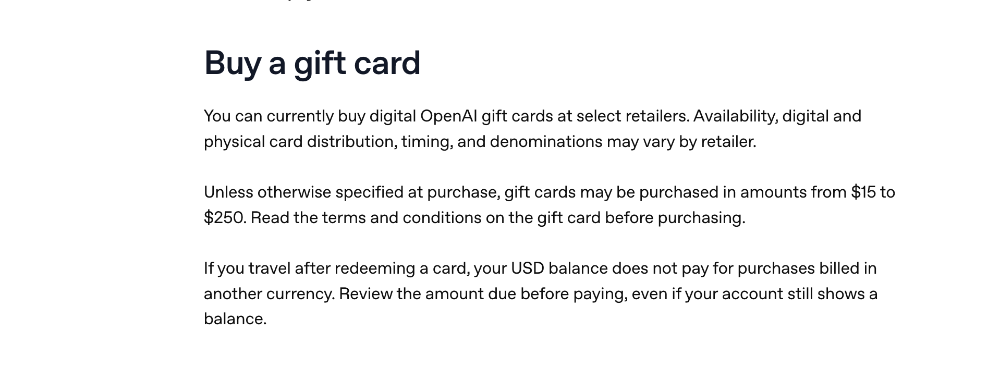
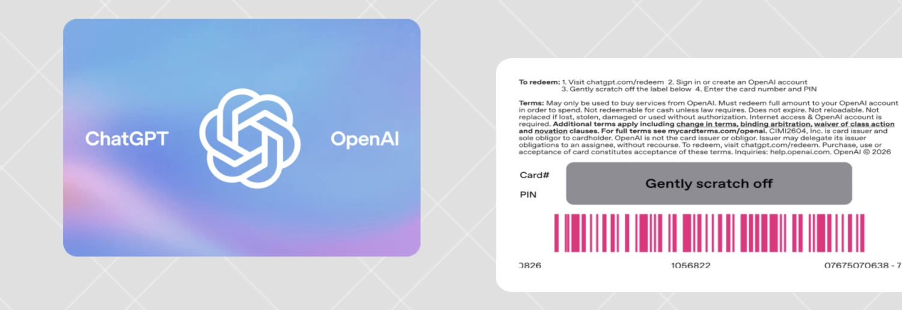
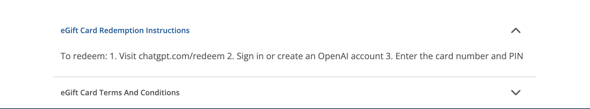

# OpenAI Gift Card 怎么买？ChatGPT 官方礼品卡购买与兑换指南（2026）

> **本次更新：2026 年 9 月 19 日（北京时间）**
>
> **Best Buy 已上架 OpenAI ChatGPT 官方数字礼品卡，面额为 $25 / $50 / $100 / $200。** 商品由 Best Buy 销售，兑换信息通过邮件和订单详情交付。[查看商品与购买说明](#best-buy-购买说明)
>
> 本次补充 Best Buy 的购买链接、支付方式、商品页和结账截图。BJ’s、RaiseRight 的购买说明及 ChatGPT Wallet 兑换步骤也保留在下方，方便按自己的情况选择。

## 30 秒结论

OpenAI Gift Card 是用于 ChatGPT 的美元储值礼品卡，卡片为一次性加载，不能再次加值。兑换后，礼品卡的全部金额会进入该账号的 ChatGPT Wallet，再由钱包在符合条件的 ChatGPT 网页结账中自动抵扣。

购买前先看这五点：

1. **购买和兑换当前仅限美国。**
2. 兑换人必须真实身处美国，并使用美国、美元计费的 ChatGPT 账号；USD 余额不能抵扣其他币种的账单。
3. 官方礼品卡 PIN 直接在 [chatgpt.com/redeem](https://chatgpt.com/redeem) 兑换。
4. 兑换礼品卡只会增加 Wallet balance，**不会自动开通 Plus 或 Pro**。
5. Wallet 不能支付 Apple App Store、Google Play 管理的订阅，也不能支付 OpenAI API 账单。

以上使用条件见 [OpenAI 购买与兑换说明](https://help.openai.com/en/articles/20001491-buying-and-redeeming-openai-gift-cards)。零售渠道上线后，美国地区和 USD 计费要求仍然适用。

> [!NOTE]
> **先分清两个 Wallet：** RaiseRight Wallet 保存购买到的电子礼品卡；在 ChatGPT 官方页面完成兑换后，金额才会进入 ChatGPT Wallet。收到电子卡，不等于已经充值到 ChatGPT。

**按你的目的继续：** [查看三个购买渠道](#现在在哪里购买) · [Best Buy 面额与支付](#best-buy-购买说明) · [BJ’s 商品说明](#bjs-购买说明) · [RaiseRight 流程与手续费](#raiseright-购买流程与手续费) · [国内用户怎么选择](#国内用户怎么选择) · [查看兑换步骤](#官方兑换步骤)

## 目录

- [OpenAI Gift Card 到底是什么](#openai-gift-card-到底是什么)
- [现在在哪里购买](#现在在哪里购买)
- [Best Buy 购买说明与支付方式](#best-buy-购买说明)
- [BJ’s 购买说明](#bjs-购买说明)
- [RaiseRight 购买流程与手续费](#raiseright-购买流程与手续费)
- [国内用户怎么选择](#国内用户怎么选择)
- [怎样判断是不是官方礼品卡](#怎样判断是不是官方礼品卡)
- [购买前资格检查](#购买前资格检查)
- [官方兑换步骤](#官方兑换步骤)
- [如何用 Wallet 开通 Plus 或 Pro](#如何用-wallet-开通-plus-或-pro)
- [Wallet 与使用额度有什么区别](#wallet-与使用额度有什么区别)
- [余额与结账问题怎么处理](#余额与结账问题怎么处理)
- [第三方「ChatGPT 礼品卡」注意事项](#第三方chatgpt-礼品卡注意事项)
- [常见问题](#常见问题)
- [官方资料与更新时间](#官方资料与更新时间)

## OpenAI Gift Card 到底是什么

它不是一张银行卡，也不是直接开通一个月会员的订阅码。

  

图 1：完整条款站展示的 OpenAI ChatGPT Gift Card 卡面设计。

正确的资金路径是：

~~~mermaid
flowchart LR
    A[参与计划的授权零售商] --> B[OpenAI Gift Card PIN]
    B --> C[chatgpt.com/redeem]
    C --> D[ChatGPT Wallet 美元余额]
    D --> E[ChatGPT 网页端购买或续费]
    E --> F[当前可购买的套餐或使用额度]
~~~

兑换后会发生两件事：

- 礼品卡的全部金额进入当前账号的 ChatGPT Wallet；
- Wallet 在以后符合条件的网页结账中自动优先抵扣。

兑换后**不会**发生这些事：

- 不会因为兑换成功就自动变成 ChatGPT Plus；
- 不会增加 OpenAI API credits；
- 不会进入 Apple ID 或 Google Play 余额；
- 不会生成一张可在其他商户使用的通用支付卡。

2026 年 9 月 1 日生效的完整条款确认了这些关键信息：

| 项目 | 条款内容 |
| --- | --- |
| 使用范围 | 先全额兑换到 OpenAI 账号，再用于 OpenAI 平台内符合条件的在线交易；不能当作通用支付卡使用 |
| 卡片形式 | 实体卡或数字码（E-card），实际供应形式由零售商决定 |
| 购买金额 | 通常单张 **$15–$250**；单人购买多张时，每日合计不得超过 **$2,000** |
| 是否可重复加值 | **卡片本身不可再次加值**；同一 OpenAI 账号可以兑换一张或多张符合条件的卡，但仍受账户余额和安全限制 |
| 到期与余额费用 | 条款不设到期日，也不收取卡内余额费用；长期未使用时仍可能适用美国州无主财产规则 |
| 退款与流通 | 通常不能退款、兑换现金或有偿转售；可以无偿赠送他人，适用法律另有要求的除外 |
| 法律发行方 | CIMI2604, Inc. 是发卡方和礼品卡义务承担方；OpenAI 不是发卡方 |

具体金额选项由零售商决定。Best Buy 已列出 **$25 / $50 / $100 / $200**；BJ’s 本文收录的是 **$100 面值**商品；RaiseRight 公布 **$15–$250 范围**，具体可选金额以登录后的页面为准。

## 现在在哪里购买

本文现收录三个零售商入口。Best Buy 为本次新增核对；BJ’s 与 RaiseRight 的下列资料沿用 9 月 14 日核对记录，价格和供应以各自当前结账页为准。

| 渠道 | 已核对的面值 | 页面价格或费用 | 交付方式 |
| --- | --- | --- | --- |
| **[Best Buy](https://www.bestbuy.com/product/openai-chatgpt-25-gift-card-digital/JJG34P73VL/sku/6688130)** | **$25 / $50 / $100 / $200** | 分别标价 **$25 / $50 / $100 / $200**；最终总额看结账页 | 数字交付，邮件及订单详情提供兑换信息 |
| **[BJ’s Wholesale Club](https://www.bjs.com/product/chatgpt-100/3000000000006366253/?itemId=3000000000006366254)** | **$100** | **$98.99** 商品标价；最终总额看结账页 | Digital (Email)，发送到 BJ’s 登录邮箱 |
| [RaiseRight](https://www.raiseright.com/brands/1185-openai-chatgpt) | $15–$250 范围 | 购卡手续费取决于付款方式；最高 3% 是筹款收益 | 电子交付，保存在 RaiseRight Wallet |

Best Buy 的购买与付款步骤见下方；BJ’s 的购物资格、RaiseRight 的加入方式与手续费也有单独说明。购买前先确认自己的 ChatGPT 账号符合兑换条件。

### 新增：Best Buy

北京时间 **2026 年 9 月 19 日**核对时，Best Buy 的商品名为 **OpenAI ChatGPT Gift Card [Digital]**，页面标明由 **Best Buy** 销售，并提供四档面额。

| 面额 / 页面售价 | Best Buy 商品链接 | SKU |
| --- | --- | --- |
| **$25 / $25** | [ChatGPT $25 数字礼品卡](https://www.bestbuy.com/product/openai-chatgpt-25-gift-card-digital/JJG34P73VL/sku/6688130) | 6688130 |
| **$50 / $50** | [ChatGPT $50 数字礼品卡](https://www.bestbuy.com/product/openai-chatgpt-50-gift-card-digital/JJG34P73VQ) | 6688128 |
| **$100 / $100** | [ChatGPT $100 数字礼品卡](https://www.bestbuy.com/product/openai-chatgpt-100-gift-card-digital/JJG34P787G/sku/6688133) | 6688133 |
| **$200 / $200** | [ChatGPT $200 数字礼品卡](https://www.bestbuy.com/product/openai-chatgpt-200-gift-card-digital/JJG34P7874) | 6688129 |

  

图 2：Best Buy 商品页截图，2026 年 9 月 19 日。截图选中 $50 面额；右侧说明兑换信息通过邮件和订单详情提供。点击可查看原图。

**购买与收卡：** 登录 BestBuy.com 账号，选择面额并核对结账总额；付款后查看订单详情与收信邮箱，再按本文的[官方兑换步骤](#官方兑换步骤)操作。商品页将此卡标为**仅限美国兑换、不可退货**。页面只笼统说明购买后很快可用，**没有承诺每笔订单即时发卡或固定审核时长**。

#### 付款方式与下单注意事项

**Best Buy 的 ChatGPT 礼品卡结账页显示 Visa、Mastercard、American Express、Discover、JCB、UnionPay（银联）标识，也可以选择 PayPal 付款。** 下图是 $25 礼品卡的结账页面。

  

图 3：作者的 Best Buy $25 礼品卡结账截图，包含银联和 PayPal 付款选项。点击可查看原图。

**支持银联，不代表国内银联卡一定能成功下单。** 银行卡授权和订单审核仍会影响能否发卡。请填写真实、准确的账号和 Billing Address（账单地址），并以自己结账页提供的付款方式为准。

付款后查看订单详情和收信邮箱，留意是否有补充付款信息的通知。银行预授权不等于已经发卡；超过预计交付时间仍未收到时，先检查垃圾邮件，再联系 Best Buy 客服。

### 已核对：BJ’s Wholesale Club

**购买入口：[ChatGPT $100 · BJ’s](https://www.bjs.com/product/chatgpt-100/3000000000006366253/?itemId=3000000000006366254)**

  

图 4：BJ’s 官网提供的 $100 礼品卡商品图。该商品页选择的是电子邮件交付；卡面展示不表示邮寄实体卡。点击可查看高清原图。

北京时间 **2026 年 9 月 14 日**核对时，BJ’s 页面显示 **$100 面值、$98.99 售价**，比面值少付 $1.01；商品编号为 **360793**。这笔差额来自商品标价，不是页面上的信用卡奖励广告。

**购买时按这三步核对：**

1. 登录 BJ’s，确认账号的购物资格和收信邮箱，再打开上面的商品。
2. 确认交付方式为 **Digital (Email)**，检查数量、售价和结账总额后付款。
3. 在 BJ’s 登录邮箱收取电子卡，再按本文[官方兑换步骤](#官方兑换步骤)将金额加入 ChatGPT Wallet。

页面的数字交付说明写的是 **1–2 小时内发往登录邮箱**；规格表另有「3–5 个工作日」字段。这里按电子卡交付选项介绍，具体发送时间以订单确认信息为准。

**非 BJ’s 会员怎么处理？** BJ’s 有 [1-Day Pass](https://help.bjs.com/hc/en-us/articles/26873882893588-What-is-the-1-Day-Shopping-Pass-for-BJs-com)，但帮助页只说明可使用标准配送，未明确说明它是否适用于这款数字卡。没有会员时，应先向 BJ’s 确认购买资格，再决定是否办理会员。

BJ’s 的[退货政策](https://www.bjs.com/info/returns/)将礼品卡列为不退款商品。本段已核对上架信息，尚未测试非会员下单、具体银行卡通过情况或实际到账时间。

### 已核对：RaiseRight

**购买入口：[OpenAI ChatGPT · RaiseRight](https://www.raiseright.com/brands/1185-openai-chatgpt)**

  

图 5：2026 年 9 月 9 日的 RaiseRight 商品页，展示电子卡、金额范围与登录购买入口。点击图片可查看原图。

RaiseRight 的上架公告日期为 **2026 年 9 月 5 日**。以下内容于 **9 月 14 日复核**；上图保留的是 9 月 9 日截图，不是本次新拍的购买记录。

| 项目 | 9 月 14 日核对记录 |
| --- | --- |
| 商品名称 | OpenAI ChatGPT |
| 卡片类型 | **eGift 电子礼品卡**；本次商品页仅列出这一类型 |
| 金额范围 | **$15–$250**；具体可选金额以登录后的页面为准 |
| 购买入口 | 需要先登录，才能加入购物车 |
| 收取方式 | 电子交付并保存到 RaiseRight Wallet，也支持电子赠送 |
| 页面收益 | 最高 **3% 筹款收益**，不是购卡结账直接减免 3% |
| 兑换地址 | **chatgpt.com/redeem** |
| 条款与发行方 | 指向 mycardterms.com/openai，列明 **CIMI2604, Inc.** 为发行方 |

来源：[RaiseRight 商品页](https://www.raiseright.com/brands/1185-openai-chatgpt) · [品牌上架公告](https://www.raiseright.com/m/brand-updates/)。页面信息可能调整，购买时再次查看当前金额、费用和交付说明。

### 这个购买入口核对了哪些资料

这次核对到了三项相互对应的资料：**RaiseRight 自有域名商品页、其品牌上架公告，以及商品页列出的兑换地址和发行条款**。其中的兑换地址、发卡方和使用方式，与 OpenAI 帮助页及其链接的发卡条款对应。

OpenAI 帮助页目前仍使用「部分零售商」的表述，没有逐一列出商家名称。本文据此将 RaiseRight 收录为**已核对的零售商购买入口**；这里的核对结果不代表已完成购买或成功兑换。

Best Buy、BJ’s 的零售入口也已收录在上方。本文区分零售商正式商品页与第三方 voucher，也不把当前清单视为完整的授权零售商名录。

<strong>查看原有官方说明和实体卡示例</strong>

  

图 6：2026 年 9 月 2 日保存的官方购买说明截图。它说明计划的一般规则；本文现已另行核对并收录零售商商品页。

  

图 7：条款站的实体卡示例，保留自原版教程。本次 RaiseRight 商品页仅列出 eGift，不能据此图推定它也在售实体卡。

## RaiseRight 购买流程与手续费

### 1. 先确认自己能否使用 RaiseRight

RaiseRight 是面向学校、团队和其他组织的筹款平台。普通参与者通过组织的 **enrollment code**（加入码）加入；没有代码时可向计划负责人索取。也可以使用参与者发来的邀请链接加入，这种方式不必另填加入码。见[加入码与邀请链接说明](https://support.raiseright.com/hc/en-us/articles/360058346553-Where-to-find-my-organization-s-enrollment-code)。

购买前要同时确认两方面条件：**自己的 RaiseRight 账号能正常下单，以及最终使用的 ChatGPT 账号满足兑换和使用要求。**

### 2. 核对金额、付款方式和费用

登录后打开上面的商品页，确认金额和收取方式，再按页面进入结账。RaiseRight 帮助中心列出的付款方式包括：绑定个人银行账户、Mastercard / Visa / Discover 借记卡或信用卡，以及向计划负责人付款；具体可用方式取决于组织设置。[付款方式说明](https://support.raiseright.com/hc/en-us/articles/360050533834-What-payment-methods-can-I-use-to-buy-gift-cards)

其当前公布的在线购卡费用如下：

| 付款方式 | 每笔购卡订单的手续费 |
| --- | --- |
| 个人银行账户 ACH；组织已提供银行资料 | **$0.29** 固定费用 |
| 个人银行账户 ACH；组织尚未提供银行资料 | **$0.79** 固定费用 |
| 借记卡 | 订单总面值的 **1%** |
| 信用卡 | 订单总面值的 **3%** |

来源：[RaiseRight 手续费说明](https://support.raiseright.com/hc/en-us/articles/44378620085395-Convenience-fees-for-buying-gift-cards)。以上是购卡订单费用，不是从 ChatGPT 礼品卡余额扣除的管理费。

**费用示例：** 如果用信用卡购买 $100 面值，按当前 3% 规则计算，购卡付款为 **$103**，拿到的仍是 **$100 面值**；这是依据公布费率的计算示例，实际以结账金额为准。ChatGPT 后续订阅产生的税费另看 ChatGPT 结账页。

商品页的「最高 3%」是筹款收益：按 RaiseRight 的模式，收益用于支持关联组织，如何分配由组织决定。**它不会直接从购卡结账金额中扣除，个人实际获得的收益取决于组织的分配安排。** [筹款机制](https://www.raiseright.com/how-it-works/gift-card-fundraising) · [收益分配说明](https://www.raiseright.com/resources/organization/starting-a-new-program/)

### 3. 收到电子卡后，再到 ChatGPT 兑换

电子卡交付后可在 **RaiseRight Wallet** 查看；如购买时选择赠送，按收件邮件说明领取。随后前往 **[chatgpt.com/redeem](https://chatgpt.com/redeem)**，兑换到最终使用的 ChatGPT 账号。RaiseRight 的平台 Wallet 与 ChatGPT 的美元 Wallet 互不等同。[电子卡说明](https://support.raiseright.com/hc/en-us/articles/360048229854-About-eGift-cards)

  

图 8：2026 年 9 月 9 日的 RaiseRight 兑换说明，列出官方兑换地址及卡号、PIN 提示。点击图片可查看原图。

RaiseRight 的兑换提示提到卡号和 PIN，OpenAI 帮助页目前以输入 PIN 描述流程。请保留交付的卡号与 PIN，按官方兑换页实际出现的字段填写；不要将完整 PIN 发布到 Issue 或公开截图中。

**本段是依据公开页面整理的购买指引。** 登录后的完整金额选项、具体银行卡是否通过、实际交付速度和成功兑换结果，本文尚未实测。

## 国内用户怎么选择

**Best Buy、BJ’s 和 RaiseRight 提供了购买入口，OpenAI 礼品卡仍受美国地区和 USD 计费条件限制。** OpenAI 要求兑换者身处美国并使用符合条件的美元计费账号；将电子卡发给美国以外的收件人，不会改变兑换资格。[官方地区要求](https://help.openai.com/en/articles/20001491-buying-and-redeeming-openai-gift-cards)

如果你目前人在中国大陆，这款美国礼品卡还不能按官方说明当成面向大陆直接开放的充值方式。商品页和付款帮助也没有证明国内银行卡可以直接完成购买，不能仅凭银行卡带有 Visa 或 Mastercard 标识就推定可用。

如果你的目的是开通 ChatGPT，可以按自己的账号、设备与付款条件选择：

| 你的情况 | 下一步入口 | 需要了解的内容 |
| --- | --- | --- |
| 符合美国地区、USD 账号条件，也能在 Best Buy 购物 | [Best Buy 面额与购买说明](#best-buy-购买说明) | 确认面额、付款方式与订单交付状态 |
| 符合美国地区、USD 账号条件，也能在 BJ’s 购物 | [BJ’s ChatGPT $100 商品页](https://www.bjs.com/product/chatgpt-100/3000000000006366253/?itemId=3000000000006366254) | 核对账号购物资格、结账总额与接收电子卡的邮箱 |
| 符合美国地区、USD 账号条件，也能使用 RaiseRight | [RaiseRight OpenAI ChatGPT 商品页](https://www.raiseright.com/brands/1185-openai-chatgpt) | 确认计划注册、购卡手续费及交付后，再按官方规则兑换 |
| 已有 OpenAI 支持的付款方式 | [ChatGPT 官网计划](https://chatgpt.com/pricing/) | 在自己的账号中选择套餐并完成网页结账 |
| 想用微信充值 ChatGPT Plus | **[AONIR Plus ¥168 / 月](https://aonir.com/chatgpt-plus/?utm_source=github&utm_medium=referral&utm_campaign=openai_gift_card&utm_content=options_plus)** | 查看账号要求后自助下单，充值到本人账号 |
| 需要 Pro 的更高用量 | [AONIR Pro 5× / 20× 方案](https://aonir.com/chatgpt-pro/?utm_source=github&utm_medium=referral&utm_campaign=openai_gift_card&utm_content=options_pro) | 将当前套餐和到期时间告知客服，确认可安排的服务 |
| 有 iPhone / iPad，希望自行使用 Apple 礼品卡 | [Apple 礼品卡 4 步实测教程](https://github.com/Avarce/chatgpt-plus-china-guide#支付宝买美区礼品卡实测流程附截图) | 礼品卡进入 Apple 账户，再通过 ChatGPT iOS App 订阅 |
| 还没确定采用哪种方式 | [无境外信用卡的五种开通路径](https://aonir.com/guides/chatgpt-plus-without-foreign-card/?utm_source=github&utm_medium=referral&utm_campaign=openai_gift_card&utm_content=options_compare) | 按设备、付款条件与后续维护要求比较 |

**AONIR 为本文维护方，提供独立第三方会员充值服务。** 上表中的 AONIR 链接对应会员充值服务，不是 Best Buy、BJ’s 或 RaiseRight 礼品卡销售、兑换入口，也不代表 AONIR 获得 OpenAI 礼品卡零售授权。AONIR 支持微信支付，充值到用户本人账号，不提供共享账号。

## 怎样判断是不是官方礼品卡

看到新商品页时，先检查下面这条证据链：

1. **销售方可验证。** 最强证据是 OpenAI 官方帮助页直接列出或链接该零售商；其次是零售商自己的正式商品页、适用条款和发行信息能彼此对应。
2. **产品名称与用途一致。** 商品应明确是 OpenAI Gift Card，并说明兑换为 ChatGPT Wallet balance。
3. **兑换域名正确。** 官方 PIN 应直接在 [chatgpt.com/redeem](https://chatgpt.com/redeem) 使用。
4. **条款一致。** 地区、币种、金额、退款和使用限制应与[官方帮助页](https://help.openai.com/en/articles/20001491-buying-and-redeeming-openai-gift-cards)及[礼品卡条款](https://mycardterms.com/openai/home/terms/)一致。
5. **不从转售市场购买。** 官方条款提示，从未经授权的卖家、转售商或拍卖网站取得的卡可能无效。

如果一个产品要求你先去第三方网站兑换，再生成卡号、有效期和 CVV，最后把它作为支付卡填进 ChatGPT 收银台，那么它属于第三方支付产品，**不是本次新上线、在 chatgpt.com/redeem 兑换的 OpenAI Gift Card**。

## 购买前资格检查

购买前，先确认以下条件：

| 检查项 | 需要满足的条件 |
| --- | --- |
| 人所在地区 | 兑换时真实身处美国 |
| ChatGPT 账号 | 美国账号 |
| 账号结算币种 | USD |
| 购买来源 | 参与计划的零售商；卡片已经正确购买并激活 |
| 工作区 | 个人使用选 Personal workspace；Business 只有所有者能向已创建的工作区兑换，个人余额不能支付创建 Business 的首笔订阅 |
| 计划支付的项目 | ChatGPT 网页端符合条件的订阅、续费或 credits 购买 |
| Apple / Google 订阅 | Wallet 不抵扣应用商店账单；转网页前先确认目标套餐的可购买状态与现有订阅的计费安排 |
| 购买金额 | 单张通常为 $15–$250，并应覆盖计划价格和可能产生的税费 |
| 收件邮箱 | 能正常接收数字卡与收据 |

OpenAI 明确写明，礼品卡的购买和兑换目前仅限美国。把卡发送给美国以外的人，并不会让对方自动获得兑换资格。

不要在最终账号之外先试兑。礼品卡必须一次性、全额兑换进一个账号，兑换后不能拆分，也不能把 Wallet balance 移到另一个账号。

## 官方兑换步骤

在 Best Buy、BJ’s、RaiseRight 等零售商购买并收到礼品卡后，官方兑换流程如下：

  

图 9：2026 年 9 月 2 日保存的 ChatGPT 官方兑换页截图，作为界面参考；输入字段以当前页面为准。

1. 在浏览器打开 [chatgpt.com/redeem](https://chatgpt.com/redeem)。
2. 登录最终要充值的 ChatGPT 账号。
3. 如果页面要求选择 workspace，确认是正确的 Personal workspace 或符合规则的 Business workspace。
4. 输入礼品卡 PIN。
5. 再次核对账号、工作区和金额，然后确认兑换。
6. 打开 ChatGPT 的 **Settings → Billing**。
7. 检查 Wallet balance 和 Transaction history，确认礼品卡记录已经出现。

兑换前务必检查账号。官方规则要求礼品卡全部金额一次性进入一个账号；兑换完成后，原卡或兑换码不再有价值，余额不能移动到其他账号，也不能退回原卡。卡片本身不能再次加值，但可以继续向同一账号兑换其他符合条件的礼品卡，前提是不超过账户余额、每日加载和安全限制。**购卡上限与账号兑换上限是两回事，当天花掉余额也不会重置当天的加载额度。**

  

图 10：2026 年 9 月 2 日保存的账单页面截图。US$0.00 是当时兑换前的余额，不是本次购买或兑换记录。

## 如何用 Wallet 开通 Plus 或 Pro

礼品卡兑换成功后，还要单独完成符合条件的订阅购买：

1. 保持登录同一个 ChatGPT 账号，在网页端打开升级页面。
2. 选择该账号当前可购买的计划，并核对适用条件。
3. 在付款确认页检查计划价格、税费、Wallet applied 和 Due today。
4. 如果余额不足，结账页会要求使用其他付款方式支付差额。
5. 如果余额足额覆盖，部分结账可能允许暂不添加付款方式；但 OpenAI 明确说明，这并不适用于所有结账，试用或促销也可能仍要求付款方式。
6. 确认购买后，检查当前计划、下次续费日期、钱包剩余余额和交易记录。

ChatGPT Wallet 会自动优先抵扣，用户不能指定「这次只使用一部分钱包余额」。卡内有余额也不等于已经订阅，必须完成上面的计划购买。

[OpenAI 当前帮助页](https://help.openai.com/en/articles/6950777-what-is-chatgpt-plus)显示 ChatGPT Plus 为 $20/月，但最终应以账号结账页显示为准，税费可能使应付总额高于 $20。不要只按标价购买刚好等额的礼品卡，再假设一定能够覆盖最终账单。

## Wallet 与使用额度有什么区别

ChatGPT 里出现的美元余额、使用额度和赠送链接，处理的是不同事情：

| 名称 | 你拿到或增加的是什么 | 用途 |
| --- | --- | --- |
| OpenAI Gift Card | 在官方兑换页使用的 PIN | 兑换后增加 ChatGPT Wallet 美元余额 |
| ChatGPT Wallet | 账号中的美元余额 | 支付符合条件的网页订阅、续费或额度购买 |
| 使用额度（usage credits） | 支持相应功能的用量额度 | 按账号和计划规则用于 Work、Codex 等支持的功能；需要单独购买 |
| Gifting Credits | 给收礼人的一次性领取链接 | 领取后增加对方的使用额度，不是 Wallet 美元余额 |

**给 Wallet 充值，并不会同时买好 Codex / Work 使用额度。** 符合条件时，可以再用 Wallet 完成额度购买；若已开启 credits auto-reload，自动购买额度也会先使用可用 Wallet 余额，再扣其他付款方式。这里的自动购买不会给原礼品卡再次加值。[礼品卡使用说明](https://help.openai.com/en/articles/20001491-buying-and-redeeming-openai-gift-cards) · [Wallet 说明](https://help.openai.com/en/articles/20001508-using-your-chatgpt-wallet-balance)

Gifting Credits 则有单独的时间规则：领取链接需在购买后 **30 天内**使用，领取后的额度有效期为 **12 个月**。30 天内无人领取，链接失效并按规则退回购买人的原付款方式。它仍在逐步开放，购买人和收礼人的账号、地区、计费币种也要符合要求；不要套用本文礼品卡「不设到期日」的规则。[赠送 credits 官方说明](https://help.openai.com/en/articles/20001417-gifting-credits-in-chatgpt)

## 余额与结账问题怎么处理

先到持有余额的账号打开 **Settings → Billing**，结合交易记录排查：

| 看到的情况 | 先检查什么 |
| --- | --- |
| `Loading balance…` 或 `Not available` | 表示余额暂未显示，不等于余额为零。刷新后再看交易记录，不要为了测试而再买一张卡 |
| 兑换记录已出现，账号仍是 Free | 兑换与购买订阅是两个步骤；检查是否完成了套餐结账 |
| 有余额，但结账没有抵扣 | 核对账号、工作区、USD 币种和购买资格，再看 `Wallet applied` 与 `Due today` |
| 新增可用余额少于卡面金额 | 先查已有待付款项、购买记录和账单调整；不能只凭余额差额判断兑换失败 |
| 收据显示应付为 $0 | 可能是 Wallet 已经付清，不代表套餐免费；看订单总额和资金来源 |

以上排查依据：[Wallet 余额、交易记录与常见问题](https://help.openai.com/en/articles/20001508-using-your-chatgpt-wallet-balance)。个人余额和 Business 工作区余额分别管理，切换工作区不会把钱转过去。

**退款也要区分两件事：** 已兑换余额不能提回原卡；如果用余额购买的 ChatGPT 项目获批退款，原本由 Wallet 支付的部分会退回 Wallet，其他付款方式支付的部分按相应方式退款。使用礼品卡并不额外增加退款资格。[官方退款说明](https://help.openai.com/en/articles/20001491-buying-and-redeeming-openai-gift-cards)

## 第三方「ChatGPT 礼品卡」注意事项

搜索「ChatGPT Gift Card」时，可能会看到 Rewarble 或其他第三方 voucher。它们不一定是假产品，但**不等于这次 OpenAI 新上线的官方礼品卡**。

> [!CAUTION]
> Rewarble 的流程是先在其网站兑换 voucher，再生成带卡号、有效期和 CVV 的 Reward Card；这一流程与直接兑换 Wallet 余额不同。OpenAI Gift Card 应在 chatgpt.com/redeem 兑换并进入 ChatGPT Wallet。

Rewarble 当前页面也明确说明其为独立平台，展示其他品牌名称和标识不代表背书、关联或赞助。[Rewarble 自有说明](https://rewarble.com/brands/chatgpt)

判断时同时核对**销售来源、发卡条款、兑换域名和余额去向**。仅凭商品名称含有 ChatGPT，或展示了 ChatGPT Logo，不足以确认它属于官方礼品卡计划。

## 常见问题

<strong>OpenAI Gift Card 现在到底可以买到了吗？</strong>

**目前已收录 Best Buy、BJ’s 和 RaiseRight 三个购买入口。** Best Buy 有 $25 / $50 / $100 / $200 四档数字卡；BJ’s 与 RaiseRight 的面额、价格和购买要求见[购买渠道对照](#现在在哪里购买)。

<strong>Best Buy 可以用国内银联卡购买吗？</strong>

**结账页显示 UnionPay（银联）标识，但国内发行的银联卡不保证都能通过。** 实际还要看银行卡授权和订单审核结果，填写账单资料后，以自己的结账结果为准。详见[结账截图与支付说明](#best-buy-结账截图)。

<strong>Best Buy 显示付款了，为什么还没收到礼品卡？</strong>

银行预授权不等于已经发卡。先查看订单详情、邮箱和垃圾邮件，按邮件提示处理付款问题；超过订单预计交付时间仍未收到时，联系 Best Buy 客服。

<strong>BJ’s 这款 $100 礼品卡会寄实体卡吗？</strong>

本文核对的商品选择是 **Digital (Email)**，发送到 BJ’s 登录邮箱。官网展示的包装式卡面图不代表邮寄实体卡；交付方式和预计发送时间以订单确认为准。详见[BJ’s 购买说明](#bjs-购买说明)。

<strong>官方固定面额是 $15、$25、$50、$100、$200 和 $250 吗？</strong>

不是所有零售商通用的固定面额表。Best Buy 已核对的四档是 **$25 / $50 / $100 / $200**；BJ’s 本文收录 **$100 面值**商品；RaiseRight 显示 **$15–$250 范围**，完整可选金额或步进需要登录后查看。

<strong>RaiseRight 的 3% 是直接打折吗？</strong>

不是结账直接减免 3%。页面写的是筹款收益，用于关联组织及其安排；购卡还可能收取支付手续费。不要把收益比例和购卡折扣混为一谈。详见[手续费与收益说明](#raiseright-购买流程与手续费)。

<strong>人在中国大陆，可以直接买来给自己的 ChatGPT 充值吗？</strong>

按当前官方规则，OpenAI 礼品卡购买和兑换仅限美国，兑换要求身处美国并使用符合条件的 USD 账号。收到数字卡或看见兑换入口，都不代表已经满足这些条件；Best Buy、BJ’s 和 RaiseRight 的上架没有改变 OpenAI 的地区规则。

<strong>卡在 RaiseRight Wallet 里，为什么 ChatGPT 余额没有增加？</strong>

RaiseRight Wallet 保存的是电子卡。需要在 chatgpt.com/redeem 完成官方兑换后，金额才会进入 ChatGPT Wallet；这两个钱包之间不会自动同步余额。

<strong>兑换礼品卡后会立刻变成 ChatGPT Plus 吗？</strong>

不会。兑换只把金额充入 ChatGPT Wallet。你还要在 ChatGPT 网页端选择 Plus，并完成一次正式结账。

<strong>有 OpenAI Gift Card 就一定不需要银行卡吗？</strong>

不能保证。官方说部分余额足额覆盖的结账可能允许暂不添加付款方式，但并非所有结账都支持；试用、促销、余额不足或特定账号状态仍可能要求付款方式。

<strong>礼品卡能支付 OpenAI API 吗？</strong>

不能。ChatGPT Wallet 与 OpenAI API billing 是两个独立系统。

<strong>礼品卡会过期吗？</strong>

2026 年 9 月 1 日版条款写明，礼品卡不设到期日，也不从卡内余额收取费用；但长期未使用时，余额仍可能按美国州无主财产法律处理。因此准确说法是「不设到期日」，不应简化成「任何情况下永久有效」。

<strong>同一个账号能兑换多张吗？</strong>

可以。卡片本身不可再次加值，但同一个 OpenAI 账号可以兑换一张或多张符合条件的礼品卡。完整条款规定，单人购买多张礼品卡时每日合计不得超过 $2,000；兑换仍受账户余额、每日加载和安全限制，因此不能理解成无限叠加。

<strong>礼品卡可以转卖或送人吗？</strong>

完整条款禁止有偿转售、交换或以物易物，但允许不收取对价地赠送给他人。收礼人仍必须符合美国地区、USD 账号和兑换资格要求。

<strong>兑换错账号后能转移吗？</strong>

不能。确认兑换前一定要核对账号和 workspace。

<strong>当前通过 Apple App Store 或 Google Play 订阅，能直接改用 Wallet 续费吗？</strong>

不能直接抵扣。若考虑转为网页订阅，先确认所需套餐的可购买状态、当前订阅的到期日与官方转订阅要求，再决定是否更换计费渠道。

<strong>购买后没收到卡，或者 PIN 无法兑换，应该找谁？</strong>

购买、付款、邮件送达、卡片激活以及未使用卡能否退款，先联系零售商并遵循其政策；PIN 兑换、Wallet 或 ChatGPT 结账问题联系 OpenAI Support。

<strong>Gifting Credits 和 OpenAI Gift Card 是同一种东西吗？</strong>

不是。一个增加使用额度，一个增加 Wallet 美元余额；领取方式和时间规则也不同。详见[Wallet 与使用额度的区别](#wallet-与使用额度有什么区别)。

## 官方资料与更新时间

以下是本文用到的 OpenAI 帮助文档、礼品卡条款和零售商页面，购买前可以查看最新说明：

1. [OpenAI：Buying and redeeming OpenAI Gift Cards](https://help.openai.com/en/articles/20001491-buying-and-redeeming-openai-gift-cards)
2. [OpenAI：Using your ChatGPT wallet balance](https://help.openai.com/en/articles/20001508-using-your-chatgpt-wallet-balance)
3. [OpenAI Gift Card Terms and Conditions（2026-09-01 生效）](https://mycardterms.com/openai/home/terms/)
4. [OpenAI：Gifting credits in ChatGPT](https://help.openai.com/en/articles/20001417-gifting-credits-in-chatgpt)
5. [OpenAI：What is ChatGPT Plus?](https://help.openai.com/en/articles/6950777-what-is-chatgpt-plus)
6. [Rewarble ChatGPT 页面](https://rewarble.com/brands/chatgpt)（仅用于区分第三方产品，不作为 OpenAI 授权证明）
7. [RaiseRight：OpenAI ChatGPT 商品页](https://www.raiseright.com/brands/1185-openai-chatgpt)
8. [RaiseRight：Brand Updates（2026-09-05 ChatGPT 上架公告）](https://www.raiseright.com/m/brand-updates/)
9. [RaiseRight：购卡付款方式](https://support.raiseright.com/hc/en-us/articles/360050533834-What-payment-methods-can-I-use-to-buy-gift-cards)
10. [RaiseRight：购卡手续费](https://support.raiseright.com/hc/en-us/articles/44378620085395-Convenience-fees-for-buying-gift-cards)
11. [RaiseRight：加入码与邀请链接](https://support.raiseright.com/hc/en-us/articles/360058346553-Where-to-find-my-organization-s-enrollment-code)
12. [RaiseRight：eGift 电子卡说明](https://support.raiseright.com/hc/en-us/articles/360048229854-About-eGift-cards)
13. [RaiseRight：筹款机制](https://www.raiseright.com/how-it-works/gift-card-fundraising)与[组织收益分配](https://www.raiseright.com/resources/organization/starting-a-new-program/)
14. [BJ’s：ChatGPT $100 商品页](https://www.bjs.com/product/chatgpt-100/3000000000006366253/?itemId=3000000000006366254)
15. [BJ’s：1-Day Shopping Pass 说明](https://help.bjs.com/hc/en-us/articles/26873882893588-What-is-the-1-Day-Shopping-Pass-for-BJs-com)
16. [BJ’s：退货政策（礼品卡不退款）](https://www.bjs.com/info/returns/)
17. Best Buy：ChatGPT 数字礼品卡 [ $25 ](https://www.bestbuy.com/product/openai-chatgpt-25-gift-card-digital/JJG34P73VL/sku/6688130) · [ $50 ](https://www.bestbuy.com/product/openai-chatgpt-50-gift-card-digital/JJG34P73VQ) · [ $100 ](https://www.bestbuy.com/product/openai-chatgpt-100-gift-card-digital/JJG34P787G/sku/6688133) · [ $200 ](https://www.bestbuy.com/product/openai-chatgpt-200-gift-card-digital/JJG34P7874)
18. [Best Buy：Payment Methods（线上支付名单与授权流程）](https://www.bestbuy.com/site/help-topics/payment-options/pcmcat203400050003.c?id=pcmcat203400050003)

### 更新记录

- **2026-09-19（北京时间）：** 新增 Best Buy 的 $25 / $50 / $100 / $200 数字礼品卡购买链接、页面价格及收卡步骤，加入商品页和 $25 结账页两张截图，补充银联、PayPal 等支付选项和国内银行卡下单注意事项。保留原有八张图片及历史日期、三个 AONIR 服务链接。

- **2026-09-14（北京时间）：** 新增 BJ’s $100 礼品卡商品页、$98.99 页面售价、电子邮件交付说明及官网高清商品图，补充两个购买渠道的对照、非会员购买资格和零售商退款政策。重新核对 RaiseRight 与 OpenAI 资料，增加 Wallet、使用额度与 Gifting Credits 对照，以及余额、结账和退款排查。原有七张图片保留历史日期，三个 AONIR 服务链接不变；本次未进行实购或兑换。

- **2026-09-09（北京时间）：** 核对并收录 RaiseRight 正式商品页与 9 月 5 日上架公告，更新 eGift、$15–$250 范围、购卡登录条件、筹款收益及付款手续费；补充 RaiseRight Wallet 与 ChatGPT Wallet 的区别，加入当日商品页和兑换说明截图。将「暂未收录购买入口」更新为「已收录 RaiseRight」，保留美国地区要求、历史截图和既有会员服务入口。本次未进行实购或兑换。

- **2026-09-06 05:06（北京时间）：** 复核 OpenAI 购买说明与 Wallet 帮助页；将“官方已宣布部分零售商销售”和“本文尚未收录可核对购买链接”分别写清。增加按阅读目的跳转的入口，区分 Plus 自助充值、Pro 咨询、Apple 礼品卡实测和方式比较。保留 9 月 2 日截图，未新增实购记录。

- **2026-09-02 21:47（北京时间）：** 按 2026-09-01 版完整条款复核全文；补充实体卡与数字码、单卡 $15–$250、单人每日 $2,000 购买上限、卡片不可再次加值、多卡兑换、无主财产规则及禁止转售等边界；加入卡面和实体卡示例。官方帮助页仍未列出零售商名称或购买链接。
- **2026-09-02：** 创建首版状态追踪与兑换教程；核对官方帮助页、Wallet 规则、礼品卡条款、第三方 voucher 路径及公开零售商搜索结果。加入官方购买说明、兑换页和兑换前 Wallet 三张截图；尚未发现 OpenAI 官方可反向验证的零售商购买页，未声称完成实购。

---

如果你发现新的零售商商品页，或发现本文某项规则已经变化，欢迎提交 Issue，并附上零售商自己的公开页面或官方文档链接。请勿提交完整礼品卡 PIN、订单资料或账号凭据。

本文为独立研究和操作记录，不代表 OpenAI。ChatGPT、OpenAI 及相关名称和标识归其权利人所有。
